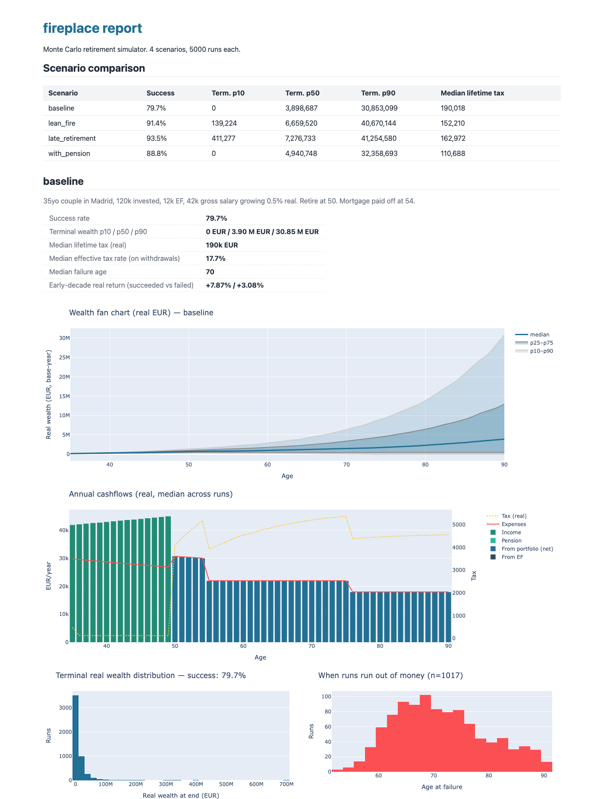
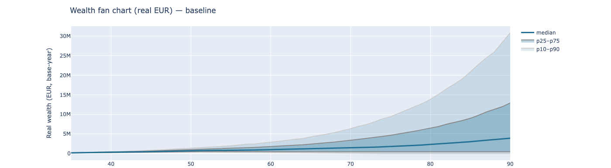
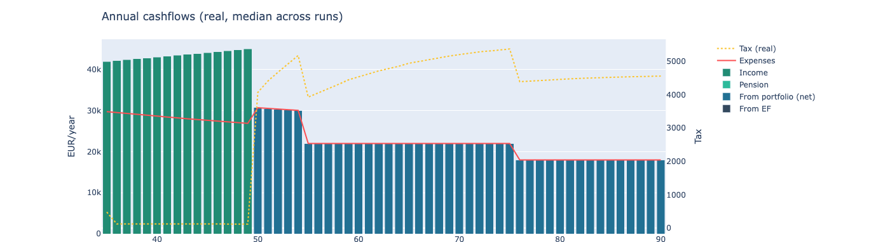
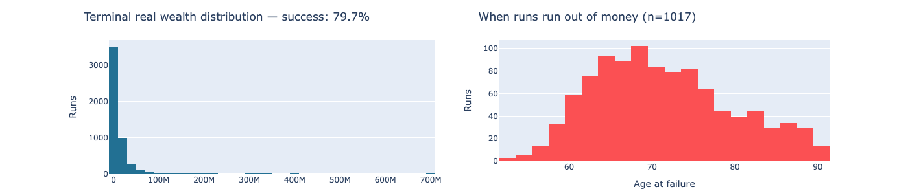
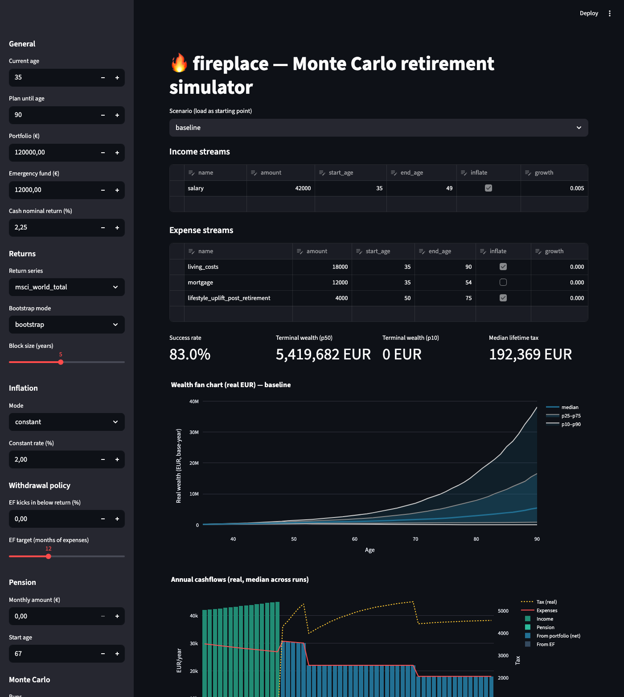
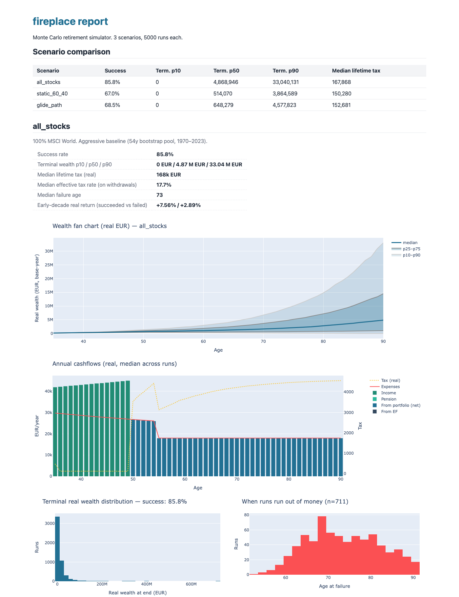

# fireplace

Monte Carlo retirement simulator with bucket withdrawals, Spain-aware tax, and
pluggable expense windows. Inspired by [thefire.site](https://es.thefire.site/calculadora-retiro-temprano/),
extended for variance, multi-scenario comparison, and historical-bootstrap returns.



## What it does

For a given case (you, your portfolio, your expense plan) it runs N independent
Monte Carlo paths against bootstrapped historical returns + CPI, applies a
two-bucket withdrawal strategy, models Spain savings-income tax with FIFO
cost basis and bracket stacking, and reports:

- **Success rate** (fraction of runs that don't run out of money before `end_age`)
- **Terminal wealth distribution** (p10 / p50 / p90)
- **Withdrawal-rate metrics** — median year-1 WR (the FIRE 4%-rule analogue) and
  median peak WR among surviving runs, plus a per-age WR percentile chart
- **Funded ratio** at retirement (assets ÷ PV of future real spending)
- **Legacy / drawdown** — chance of ending at or above your starting pot, and
  median worst peak-to-trough real-wealth drawdown
- **Sequence-of-returns risk decomposition** — how the early decade looks in
  failed vs successful runs, and how severe failures are (median plan-years short)
- **Withdrawal-source breakdown** (per-year median: portfolio, EF, income, pension)
- **Tax drag** — lifetime savings-income tax paid, effective rate on withdrawals,
  and (optionally) lifetime net-wealth tax
- **Sustainable spending & die-with-zero solvers** (`--solve` / `--dwz`) — the
  largest uniform spend multiple that still clears a target success rate, and the
  one that drives median terminal wealth to zero

Each scenario also gets a deterministic, templated **Result block and verdict**
derived purely from its numbers (`fireplace summary`), so the editorial read
never drifts from the model.

Multiple scenarios share a single YAML file via inheritance, so you can compare
"baseline vs lean-FIRE vs work-five-more-years" in one report.

### Inside the report

Wealth fan chart — median, p25–p75 and p10–p90 bands of real wealth over time:



Annual cashflows — where each year's spending is sourced from (income, pension,
portfolio, EF) and the tax line on the secondary axis:



Terminal wealth distribution and the age at which failed runs ran out:



## Quick start

Install:

```bash
git clone https://github.com/ivanol55/montecarlo-fireplace.git && cd montecarlo-fireplace
python3 -m venv .venv && source .venv/bin/activate
pip install -e ".[ui,dev]"
```

Run a static HTML report:

```bash
fireplace run examples/spain_default.yaml -o out/report.html
open out/report.html
```

Add the spending solvers (each re-simulates, so they're slower):

```bash
fireplace run examples/spain_default.yaml --solve --dwz -o out/report.html
```

`--solve` adds the largest uniform spend multiple that still clears 95% success;
`--dwz` adds the die-with-zero multiple (the spend that drives median terminal
wealth to zero). Both show up per scenario in the console and the report.

Or an interactive Streamlit app — tweak any input and re-run live:

```bash
fireplace streamlit examples/spain_default.yaml
```



List the scenarios defined in a config:

```bash
fireplace list examples/spain_default.yaml
```

Print the deterministic Result block + verdict for each scenario — the AI-free
way to refresh prose summaries (same numbers in, same text out):

```bash
fireplace summary examples/spain_default.yaml
```

## Configuring your case

A YAML file declares `defaults` (a partial Case) and `scenarios` (each a
partial Case overriding defaults). Income and expense streams have explicit
age windows and an inflate flag — that's how the source site models a mortgage
that ends at age 54 or a lifestyle that uplifts in retirement.

Full field reference: [docs/CONFIG.md](docs/CONFIG.md). The example below shows
the most common bits.

```yaml
defaults:
  age: 35
  end_age: 90
  portfolio: 120000
  emergency_fund: 12000
  inflation_mode: bootstrap
  inflation_series: eurozone_hicp  # 1999+ Eurozone HICP, paired with same-year returns
  return_series: msci_world_total  # bootstrap from data/returns_annual.csv
  tax:                             # Spain savings-income brackets
    brackets:
      - [6000, 0.19]
      - [50000, 0.21]
      - [200000, 0.23]
      - [300000, 0.27]
      - [.inf, 0.28]
  withdrawal:
    bucket_threshold: 0.0          # EF kicks in if portfolio return < 0
    ef_target_months: 12
  incomes:
    - { name: salary,   amount: 42000, start_age: 35, end_age: 49, inflate: true,  growth: 0.005 }
  expenses:
    - { name: living,   amount: 18000, start_age: 35, end_age: 90, inflate: true  }
    - { name: mortgage, amount: 12000, start_age: 35, end_age: 54, inflate: false }

scenarios:
  - name: baseline
  - name: lean
    expenses:
      - { name: living, amount: 14000 }    # streams merge by name
  - name: work_5_more
    incomes:
      - { name: salary, end_age: 54 }
```

### Asset allocation

By default a case has one asset (whatever `return_series` points at). The
`allocation` block lets you describe a portfolio as a mix of assets, optionally
with a glide path that shifts weights as you age. Returns are sampled at the
**same year indices** across assets, so historical correlations (e.g. 2008's
equity drawdown paired with that year's bond return) are preserved.

Two forms — static weights:

```yaml
allocation:
  assets:
    stocks: msci_world_total
    bonds:  global_agg_bond_total
  weights:
    stocks: 0.6
    bonds:  0.4
```

…or a glide path (linear interpolation between pivots, clamped at the ends):

```yaml
allocation:
  assets:
    stocks: msci_world_total
    bonds:  global_agg_bond_total
  glide_path:
    - { age: 35, stocks: 0.90, bonds: 0.10 }
    - { age: 50, stocks: 0.70, bonds: 0.30 }
    - { age: 65, stocks: 0.60, bonds: 0.40 }
    - { age: 80, stocks: 0.50, bonds: 0.50 }
```

The simulator assumes **annual rebalancing back to the target weights** with
no tax cost from the rebalance itself — accurate for fondos de inversión held
inside Indexa Capital (Spain's *traspaso* rule lets you move between fondos
without realising gains). Withdrawals still hit Spanish savings-tax via FIFO
basis as before.

Inside scenarios, the `allocation` block is **replaced wholesale** rather than
merged with `defaults` — pick one form per scenario.

Three example configs ship with allocation already wired up:

- [examples/all_stocks.yaml](examples/all_stocks.yaml) — 100% equities forever
- [examples/glide_path.yaml](examples/glide_path.yaml) — three scenarios in
  one report (`all_stocks` vs `static_60_40` vs `glide_path`) so you can see
  how variance, success rate, and tax drag move with allocation.
- [examples/indexa.yaml](examples/indexa.yaml) — the typical Spanish FIRE
  setup: Indexa Capital fondos at three risk profiles (conservative / balanced /
  aggressive) plus a DIY glide-path overlay, all funded against a 12k cuenta
  remunerada at 2.25%, with Seguridad Social pension from age 67.

The glide-path config produces a side-by-side comparison of three allocations:



## Spending evolution

Flat-real spending for 50 years is the optimistic part of any plan. Two optional
mechanisms model how spending actually moves — both acting **only** on expense
streams you mark `discretionary: true`, never on fixed costs (mortgage, upkeep,
care). They default off, so a case with neither set behaves exactly as a
flat-real plan; when both are on, their multipliers compound.

- **`spending_curve`** — a deterministic age "smile" (Bernicke / Blanchett):
  discretionary spend runs hot in the go-go 40s/50s and tapers through the
  slow-go / no-go years. It's the same multiplier for every run — just *timing*
  a fixed lifetime budget toward the healthy decades. Late-life care is a
  separate non-discretionary stream, so it provides the upward tail.

- **`dynamic_spending`** — Guyton-Klinger guardrails: each retirement year,
  compare the current withdrawal rate to the rate at retirement. If the pot is
  stretched (WR risen past `upper_guard`× the initial) cut discretionary spend by
  `cut`; if flush (WR fallen below `lower_guard`×) raise it by `bump`. The per-run
  multiplier ratchets and is clamped to `[floor, ceiling]`. This is the lever
  that lets a plan spend its right-tail surplus instead of dying rich, while
  still protecting the downside.

```yaml
expenses:
  - { name: living_retire, amount: 16800, start_age: 42, end_age: 90, inflate: true, discretionary: true }

spending_curve:
  enabled: true
  pivots:
    - { age: 42, factor: 1.20 }
    - { age: 70, factor: 0.90 }
    - { age: 85, factor: 0.80 }

dynamic_spending:
  enabled: true
  upper_guard: 1.20    # cut when WR > 1.2× the first-retirement-year WR
  lower_guard: 0.80    # raise when WR < 0.8× it
  cut: 0.10
  bump: 0.10
  floor: 0.50          # clamp the cumulative discretionary multiplier
  ceiling: 1.50
```

Together these are the honest "morir con cero" model — spend the healthy years
well and let the portfolio throttle discretionary spend up or down each year —
versus the all-or-nothing of statically front-loading expense streams. Full
field reference in [docs/CONFIG.md](docs/CONFIG.md#spending-behaviour).

[examples/spending_evolution.yaml](examples/spending_evolution.yaml) compares
flat-real vs smile-only vs guardrails-only vs both, with an optional wealth-tax
overlay — a one-command side-by-side of every mechanism in this section.

## Spain-specific guide

The model is specifically aimed at the typical Spanish FIRE setup. The two
buckets map to:

- **`portfolio`** = your fondos de inversión (e.g. an Indexa Capital plan).
  Internal rebalancing inside Indexa uses Spain's *traspaso* rule — switching
  between fondos doesn't realise gains, only withdrawals do. The simulator
  rebalances annually back to your target weights at no tax cost, which
  matches Indexa's reality. Withdrawals trigger Spanish savings-income tax on
  the realised-gain portion under FIFO basis.
- **`emergency_fund`** = your cuenta remunerada (Trade Republic, MyInvestor,
  Openbank, Revolut…). Earns nominal interest at `cash_nominal_return`. The
  interest is taxed each year at the same savings-income brackets, and stacks
  with any portfolio gains realised the same year — so taking a big portfolio
  withdrawal in a year your cuenta paid 1k of interest pushes the gain euros
  into a slightly higher bracket, just like in real life.

### Picking `cash_nominal_return` (the cuenta-remunerada rate)

`cash_nominal_return` is the **gross annual yield** your cuenta remunerada
pays. Net of tax is computed for you — don't pre-subtract the 19/21/23%.

The default in [examples/spain_default.yaml](examples/spain_default.yaml) is
**0.0225 (2.25%)**, picked as a representative mid-range gross yield in Spain
in the mid-2020s. Realistic ranges to override with:

| Provider type                                    | Typical gross APY | When to use |
|--------------------------------------------------|--------------------|-------------|
| Cuenta corriente (regular checking)              | 0.00 – 0.50%       | If your "EF" is just sitting in your nómina account. |
| Mainstream bank promo (BBVA, Santander, ING)     | 1.00 – 2.50%       | First 6 months only — drops after, model an average. |
| Trade Republic / Revolut Premium                 | 1.50 – 2.75%       | Variable, tracks ECB ESTR closely. |
| MyInvestor / Openbank / Pibank                   | 1.50 – 3.00%       | More stable promo rates over multi-year horizons. |
| Letras del Tesoro 12m (rolling)                  | 2.00 – 4.00%       | If you ladder Spanish T-bills as your "EF". Less liquid but higher yield, no withholding. |

What to actually plug in: take your bank's current gross APY, multiply by
a "stickiness factor" if it's a promo (e.g. 0.7 for a 12-month promo that
will revert to 0.5%) to get an effective long-run yield. ECB-tracking
accounts move with rates over decades, so picking ~ECB-rate-minus-50bp is a
defensible long-run estimate. Two examples:

- *"My EF earns 2.6% currently at MyInvestor, but rates were near 0% from
  2015–2022."* → use `0.018` (~1.8%) as your long-run plug.
- *"I roll Letras del Tesoro at ~3% gross right now."* → use `0.025` (~2.5%).

The simulator taxes the interest each year at Spanish savings-income brackets
and *stacks it with portfolio gains realised the same year*, so a higher
`cash_nominal_return` doesn't just mean more interest — it also pushes
portfolio-withdrawal euros into higher brackets in the years you do both.

## Modelling notes

- **Returns**: bootstrapped from `data/returns_annual.csv` — two columns,
  MSCI World Net TR EUR (unhedged) and Bloomberg Global Aggregate EUR-hedged,
  both 1999–2024. Those are the EUR-investor versions of what an Indexa
  Capital / IWDA / AGGH holder actually realises (FX exposure for stocks,
  EUR-hedged for bonds). Use `block_bootstrap` with `block_size: 5` to
  preserve some autocorrelation. See [data/SOURCES.md](data/SOURCES.md) for
  why the pool starts in 1999 (post-euro, ECB regime, Bloomberg EUR-hedged
  inception). Refresh recent years from Yahoo Finance via
  `python scripts/fetch_returns.py` (uses IWDA + AGGH proxies).
- **Inflation**: defaults to **bootstrap from `eurozone_hicp`** (1999+).
  Year indices are shared with the return columns, so a 2008 return draw
  pairs with that year's 3.3% HICP and a 2022 return draw pairs with 8.4% —
  the joint bad-return / high-inflation scenarios that historically break
  retirement plans are preserved. To use a flat rate instead, set
  `inflation_mode: constant` + `inflation_rate: 0.02`.
- **Tax**: each portfolio withdrawal grosses up against Spain's progressive
  savings-income brackets (19/21/23/27/28%), applied to the realised-gain
  portion of the withdrawal under FIFO cost basis. Cuenta-remunerada interest
  is taxed yearly under the same brackets and *stacks* with portfolio gains in
  the same year, so a big portfolio withdrawal in an interest-heavy year pays
  marginally more. Brackets index to inflation by default. Withdrawing
  principal from the cuenta remunerada itself is not taxed.
- **Wealth tax** (`wealth_tax`, **off by default**): Spain's annual *Impuesto
  sobre el Patrimonio* plus the solidarity surtax (*ITSGF*). When enabled, it's
  levied each year on net financial wealth (portfolio + EF) above an `allowance`,
  on a progressive scale over the excess; the primary residence is excluded
  (it's a mortgage/upkeep expense stream here, not a portfolio asset). It's kept
  in its own ledger separate from withdrawal tax, and reported as median lifetime
  wealth tax — but only when at least one scenario actually levies it, so
  non-Spanish or fully-bonificated (Madrid) configs stay lean. **Region-dependent:
  supply your own scale.** See [docs/CONFIG.md](docs/CONFIG.md#wealth-tax).
- **Bucket strategy** (FIRE-standard): in years where the realised portfolio
  return is below `bucket_threshold`, the simulator first draws
  `ef_share_in_bad_year × deficit` from the EF (capped by EF balance) and tops
  up from the portfolio. In good years it refills the EF toward
  `ef_target_months × monthly_expenses`. The shipped defaults across all
  example YAMLs follow the FIRE community's 2-bucket consensus
  (Kitces / Pfau / Big ERN) — see [Withdrawal sourcing: FIRE-standard
  defaults](#withdrawal-sourcing-fire-standard-defaults) below.

### Withdrawal sourcing: FIRE-standard defaults

Every shipped YAML uses the same three withdrawal-policy values. They aren't
arbitrary — they encode the FIRE community's 2-bucket consensus on where to
draw retirement spending from:

| Parameter                    | Value | FIRE rationale |
|------------------------------|-------|----------------|
| `bucket_threshold`           | `0.0` | Trigger the cash bucket whenever the portfolio prints a nominal loss. Standard "down year" definition — prevents selling depressed equities in years that historically dominate sequence-of-returns failure (2000–02, 2008, 2022). |
| `ef_target_months`           | `12`  | One year of expenses in cash. Mainstream FIRE consensus: enough to skip the worst-drawdown year without forced selling, small enough that the cash drag doesn't dominate the long-horizon equity premium. |
| `ef_share_in_bad_year`       | `1.0` | When the bucket triggers, drain the EF first (up to balance), then top up from the portfolio. Maximises the sequence-risk insurance per euro of cash held. |

**The simulator regenerates the EF in retirement.** Originally the refill
logic only fired in surplus years (accumulation), making the EF a one-shot
buffer that drained and never returned during retirement. That didn't match
how Kitces / Pfau actually describe the 2-bucket strategy. The simulator now
refills the EF whenever a year's nominal portfolio return is ≥ `bucket_threshold`,
*regardless* of whether that year also had a deficit withdrawal. Tax stacking
on the same-year realised gains is handled by the existing
`year_savings_income` ledger.

**Sensitivity to `ef_target_months` under the regenerating policy** —
success-rate sweep across the personal use case (5000 runs, 1999–2024 EUR
bootstrap):

| Scenario                     | 3mo  | 6mo  | 12mo | 18mo | 24mo |
|------------------------------|------|------|------|------|------|
| retire_45                    | 67.8 | 67.6 | 66.7 | 65.7 | 64.4 |
| retire_42_with_pension       | 63.9 | 63.5 | 62.5 | 60.9 | 58.9 |
| realistic_42_with_pension    | 74.7 | 74.4 | 73.4 | 72.2 | 71.1 |

Smaller is monotonically better, but the 3–12 month range is within bootstrap
noise (~1pp); past 12 months the cash drag becomes meaningful (−2 to −4pp at
24 months). The FIRE-community consensus of 12 months is defensible as a
behavioral tradeoff (less stress, more obvious buffer) rather than a
mathematical optimum — Big ERN's SWR series reaches the same conclusion
empirically. If you're optimising purely for success rate, drop to 3–6 months;
if you want behavioral resilience plus a buffer that survives the worst
single-year drawdown without selling, keep 12.

**Why not zero?** A 0-month buffer forces selling into every nominal-loss
year. In our bootstrap pool that's ~40% of years. Tax cost is mostly
irrelevant under FIFO (no gain to realise when V < CB) but the share-count
erosion at depressed prices is the actual problem — see the Bucket strategy
math in the Appendix.

**Want to deviate?** Override per-scenario in YAML. Common variants:

- `ef_target_months: 6` — leaner accumulation, accepts more sequence risk
- `bucket_threshold: -0.10` — keeps EF intact unless the portfolio drops >10%, useful for hoarders
- `ef_share_in_bad_year: 0.5` — half-and-half draw, avoids draining EF in a single bad year
- **Real vs nominal**: all internal accounting is nominal; reports are deflated
  to base-year ("real") EUR using each run's realised CPI.
- **Offline reports**: HTML output inlines plotly.js, so it opens with no
  network and is safe to email / commit / archive.

## Limitations (v1)

- Rebalancing inside the portfolio is treated as costless. This is accurate
  for fondos de inversión held inside Indexa Capital (traspaso rule). It is
  *not* accurate if you hold ETFs directly in a Spanish broker — there each
  rebalance trade realises gains. If that's your setup, model it manually by
  adding extra realised gains as expenses, or open an issue.
- Wealth tax (Impuesto sobre el Patrimonio / ITSGF) is modelled but **off by
  default** and highly region-dependent — you supply the regional scale (see the
  wealth-tax note below). No IRPF on labour income; income streams are entered net.
- Pension is a fixed inflation-indexed monthly amount (no SS replacement-rate model)
- Real-estate, mortgage interest, and one-off expenses must be modelled as
  custom expense streams

## Appendix: how the math works

Everything below is implemented in `src/fireplace/`. The pointers in
parentheses tell you where to look. Skip this section unless you want to
audit the numbers or extend the model.

### 1. Bootstrap sampling ([`returns.py`](src/fireplace/returns.py))

Given a historical table of `n` years (rows), we sample year indices
`i₁, …, i_T` from `{0, …, n-1}`:

- **IID bootstrap** (`block_size = 1`): each `i_y` is uniform random over the
  pool. Treats years as independent — fine for equity, wrong-ish for inflation
  and bonds where adjacent years are correlated.
- **Moving-block bootstrap** (`block_size = B`): pick `⌈T/B⌉` start indices
  uniformly in `{0, …, n-B}`, then read consecutive windows of length `B`,
  concatenate, truncate to `T`. Preserves short-run autocorrelation. Standard
  choice for return-and-inflation series; we recommend `B = 5`.

For each `(run, year)` we read **every needed column at the same `i_y`** so
historical correlations are preserved exactly: 2008's MSCI World draw of −40.7%
will always be paired with that year's bond and CPI numbers.

When you specify multiple columns whose history starts in different years,
the sampler drops rows where any needed column is missing and bootstraps
from the intersection. The bundled CSV's three columns all start in 1999
(see [data/SOURCES.md](data/SOURCES.md) for why), so the effective pool is
26 rows. With `block_size: 5` that's about 5 effective independent blocks
per simulated path — enough for ranking scenarios, but read tail percentiles
with appropriate skepticism.

### 2. Multi-asset weighted return ([`simulate.py`](src/fireplace/simulate.py))

Per `(run, year)`, the portfolio's nominal return is the dot product of
target weights and per-asset returns:

```
r(year) = Σᵢ wᵢ(age) · rᵢ(year)
```

This formulation is mathematically equivalent to **costless annual rebalancing
back to target weights**: at year start each asset holds `wᵢ · V` of capital;
each grows by `rᵢ`; at year end you rebalance back to `wᵢ`. Over the year:

```
V(year+1) = V(year) · (1 + Σᵢ wᵢ · rᵢ) = V(year) · (1 + r(year))
```

For Indexa Capital users this matches reality (traspaso rule = no realised
gain on internal rebalancing). For DIY ETF holders in a taxable Spanish broker
it's optimistic — see Limitations.

### 3. Glide-path interpolation ([`case.py:Allocation.weights_at`](src/fireplace/case.py))

Pivots are sorted by age. For age `a` between pivots `(a₁, w₁)` and `(a₂, w₂)`:

```
w(a) = w₁ + (w₂ − w₁) · (a − a₁) / (a₂ − a₁)
```

Below the first pivot or above the last: clamp to the endpoint. Each
component is interpolated independently; if the pivots themselves sum to 1
(validated at construction), interpolated weights also sum to 1.

### 4. FIFO cost basis ([`tax.py`](src/fireplace/tax.py))

Spain mandates FIFO ("primera entrada, primera salida") for fund shares. We
track a single aggregate cost basis `CB` for the portfolio. When selling
gross `G` from a portfolio with market value `V`:

```
gain_fraction = max(0, (V − CB) / V)
realised_gain = G · gain_fraction
cost_portion  = G · (1 − gain_fraction)
new_CB        = CB − cost_portion
```

This is the **proportional** approximation to lot-by-lot FIFO. It's exact
when contributions and growth are uniform; it slightly under-taxes when
recent contributions have unrealised gains compared to older lots, and
slightly over-taxes in the opposite case. For a long-horizon retirement
plan the error is well under the noise from Monte Carlo and bootstrap.

### 5. Progressive savings tax with stacking ([`tax.py`](src/fireplace/tax.py))

Spain's `base imponible del ahorro` combines all savings income — fund-gain
realisations, dividends, interest from cuentas remuneradas, etc. — into one
progressive bracket schedule (currently 19/21/23/27/28%).

`progressive_tax(x, B)` walks the brackets from zero and sums the slabs:

```
progressive_tax(x, [(b₁, r₁), (b₂, r₂), …]) = 
    Σₖ (min(x, bₖ) − bₖ₋₁)⁺ · rₖ      with b₀ = 0
```

When multiple operations happen in the same year (cuenta interest realises
in January, portfolio withdrawal in March, EF refill in November), each
later euro stacks on top of the prior ones. The marginal tax on `extra`
stacked above `prior` is:

```
tax_on_extra(extra | prior) = progressive_tax(prior + extra, B) − progressive_tax(prior, B)
```

This is exact, not an approximation. The simulator maintains a per-run
`year_savings_income` that grows as each operation lands.

### 6. Gross-up Newton iteration ([`tax.py:gross_up_for_withdrawal`](src/fireplace/tax.py))

When the simulator needs `net_needed` of cash and must sell from the
portfolio, it solves for the gross withdrawal `G` such that

```
G − tax_on_extra(G · gain_fraction | prior) = net_needed
```

Define `f(G) = G − [progressive_tax(prior + G · gain_fraction, B) − progressive_tax(prior, B)]`.
Then `f` is piecewise linear in `G`, monotonically increasing, with derivative

```
f'(G) = 1 − marginal_rate(prior + G · gain_fraction) · gain_fraction
```

Newton step: `G ← G + (net_needed − f(G)) / f'(G)`. Converges in under 10
iterations because the function is piecewise linear; the initial guess uses
the marginal rate at `prior`. We cap `G ≤ V` (can't withdraw more than the
portfolio holds).

### 7. Bucket withdrawal strategy ([`simulate.py`](src/fireplace/simulate.py))

In each year, after computing the deficit `D = expenses − income − pension`:

- If `D > 0` (deficit) **and** the portfolio's nominal return that year was
  below `bucket_threshold` **and** EF balance > 0:
  - Take `min(D · ef_share_in_bad_year, EF)` from the cuenta remunerada
  - Take the remainder from the portfolio (with gross-up)
- Otherwise: take it all from the portfolio.

In any year with `return ≥ bucket_threshold`, after the deficit handling,
refill EF toward `ef_target_months · monthly_expenses` if it's below target,
pulling from the portfolio (taxable). This fires both during accumulation
(after a surplus contribution) and during retirement (after a deficit
withdrawal) — the EF is regenerating insurance, not a one-shot buffer.

The intuition: drawing the EF in bad years avoids selling depressed equities,
mitigating sequence-of-returns risk. Refilling in good years is mechanical
"sell high". Maintaining the buffer perpetually has a real cost (cash drag
on the EF capital), which is why larger `ef_target_months` values are
empirically *worse* over long retirement horizons even though they offer
more single-year insurance — see the FIRE-standard defaults section above.

### 8. Real vs nominal ([`simulate.py`](src/fireplace/simulate.py))

All internal accounting is **nominal**. The cumulative inflation factor for
a run after `y` years is

```
π(y) = Πₜ≤y (1 + cpi_t)
```

Reported real wealth deflates each (run, year) value by its own `π(y)`:

```
V_real(y) = V_nominal(y) / π(y)
```

This means each Monte Carlo path uses *its own realised inflation* to
deflate, not a single shared inflation series. That preserves the
correlation between bad-return years and high-inflation years that
historically tend to come together (1973–74, 2022).

### 9. Sequence-of-returns risk metric ([`report.py`](src/fireplace/report.py))

For each run, compute the geometric annualised real return over the first
`min(10, T)` years:

```
g_run = [Πᵧ₌₀^9 (1 + r_y) / (1 + cpi_y)] ^ (1/10) − 1
```

The report shows the mean of `g_run` separately for runs that *failed*
(ran out of money) vs runs that *succeeded*. A wide gap is evidence that
failures are dominated by bad early decades — which is exactly the case
the bucket strategy and glide path are designed to dampen.

### 10. Discretionary spending: smile × guardrails ([`simulate.py`](src/fireplace/simulate.py), [`case.py`](src/fireplace/case.py))

Each year, expenses are split into fixed and **discretionary** (the streams
flagged `discretionary: true`). Only the discretionary part is flexed; the final
discretionary spend in a year is the planned amount times two independent
multipliers that compound:

```
disc(age, run) = disc_planned(age) · smile(age) · g(run, age)
```

- **`smile(age)`** — `SpendingCurve.factor_at`, the same deterministic age curve
  for every run, linearly interpolated between pivots `(a₁, f₁), (a₂, f₂)` and
  clamped at the ends: `f(a) = f₁ + (f₂ − f₁)·(a − a₁)/(a₂ − a₁)`.
- **`g(run, age)`** — the Guyton-Klinger ratchet. On each run's first deficit
  (retirement) year it fixes a reference WR `wr₀`. In later years, with current
  WR `wr`: if `wr > upper_guard·wr₀` then `g ← g·(1 − cut)`; if
  `wr < lower_guard·wr₀` then `g ← g·(1 + bump)`. `g` is clamped to
  `[floor, ceiling]` and carries forward year to year (it ratchets, it doesn't
  reset). Disabled mechanisms contribute a flat `1.0`, so a case with neither set
  is exactly flat-real.

### 11. Net-wealth tax ([`tax.py:wealth_tax_vec`](src/fireplace/tax.py))

When `wealth_tax.enabled`, after each year's withdrawals the assessable base is
financial wealth above the (inflation-indexed) allowance,
`base = max(0, portfolio + EF − allowance)`, and the tax is the same
progressive-slab function used for income, applied to that base against the
wealth-tax brackets:

```
wealth_tax = progressive_tax(base, wealth_brackets)
```

It's paid from the portfolio, recorded in a separate `wealth_tax_paid` ledger
(it isn't a tax on a withdrawal), deflated to real EUR, and aggregated as median
lifetime wealth tax.

### 12. Funded ratio ([`report.py:_funded_ratio`](src/fireplace/report.py))

Measured at each run's retirement year `r` (the first deficit year) — funded
ratio is only meaningful once drawdown begins. It's the median across runs of
real investable wealth over the present value of future real net spending,
discounted at a fixed real rate `FUNDED_RATIO_REAL_DISCOUNT = 2%`:

```
funded(run) = assets_real(r) / Σ_{y≥r} net_need_real(y) / (1 + 0.02)^(y − r)
```

`net_need_real` already nets out post-retirement income and pension. The 2% real
discount is a deliberately conservative safe-asset rate (an **assumption**, not a
model output — the ratio is sensitive to it), so the figure leans pessimistic vs
discounting at the portfolio's own expected return.

### 13. Withdrawal-rate metrics & spending solvers ([`report.py`](src/fireplace/report.py))

The per run-year `withdrawal_rate` series is `deficit ÷ investable wealth
pre-withdrawal`, NaN outside deficit years and after insolvency. From it:

- **Year-1 WR** — median across runs of each row's first finite entry (the FIRE
  4%-rule analogue).
- **Peak WR** — median over *surviving* runs of each run's worst (max) year.
  Failed runs trivially approach 100% as wealth hits zero, so they're excluded —
  this measures how stretched the plans that *worked* got.

The two solvers bisect on a uniform multiple applied to **all** expense streams
(mortgage included — read them as "multiple of total planned spend"):

- **`sustainable_spending`** (`--solve`) — largest multiple whose success rate is
  still ≥ a target (default 95%).
- **`spend_to_zero`** (`--dwz`) — largest multiple that still keeps the chosen
  terminal-wealth percentile (default the median) at or above a target legacy
  (default 0). Targeting the median p50 → 0 is the literal "die with zero"; the
  achieved success rate is reported alongside as the honest price of that spend.

Both re-simulate with the case's own seed, so they're deterministic for a given
case but carry the same bootstrap noise as any single Monte-Carlo figure.